**GEOG 458 Essay**
*Date: March 2, 2020*
*Author: Leo Kwo*

# Critique of the Dublin Dashboard
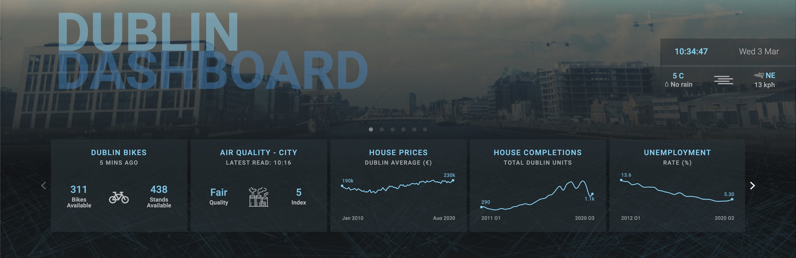

### 1. Dublin Dashboard Overview

***1.1 Project Goal***
The goal of the [Dublin Dashboard](https://www.dublindashboard.ie) is to provide tools, visualizations, and interactive webmap services about the Dublin city to the Irish public, civic planners, and policymakers.

***1.2 Major Functions***
The Dublin Dashboard features 6 themes, each completed with its own webmaps and/or data visualizations, 2 stories, 4 queries, and 2 tools. Here's the more nuanced introduction:

*1.2.1 [Themes](https://www.dublindashboard.ie/themes)*
Themes are created to help link various data visualizations and webmaps together for better presentation and interpretation. These themse were created by the authors to give the audience an overview of the Dublin city in the following six categories of interests. Each data visualization and webmap come with observations and interpretation written by the authors for context and readability.
- *Transport*
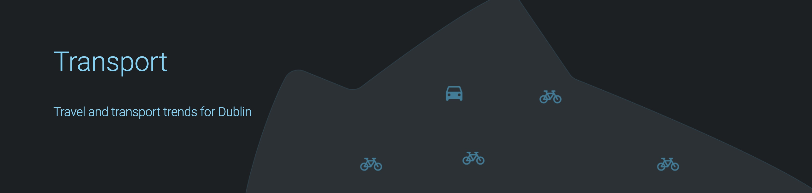
This theme features data visualizations of *public transport usage over time*, *Dublin Bike usage*, and a webmap of *traffic counters*.

- *Environment*
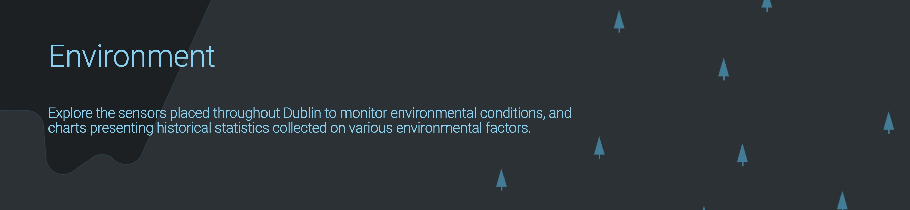
This theme features a webmap for *Noise Level Monitoring Sites of Dublin* and a visualization of *Noise Chart*.
  - Note: *Noise Level Monitoring Sites* and *Noise Chart* features are **not** working propoerly as of the moment of writing this essay.

- *Housing*
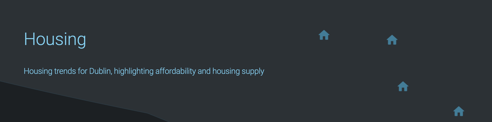
This theme features data visualizations of *House Prices over time*, *Property Price Index over time*, and *Monthly Rent Prices for Private Dwellings over time*.

- *Economy*
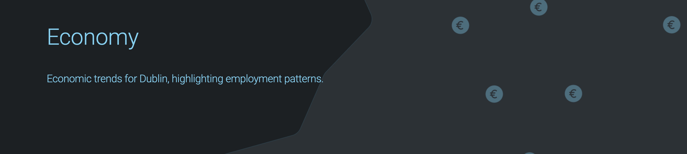
This theme features data visualizations of *Persons aged 15 and over in the labour force over time*, *Unemployed persons aged 15 or over*, *Employment by Sector*, *Number of Employees by Size of Company*, *Gross Value Added per Person at Basic Prices*, and *Dublin Port Tonnage*.
  - Note: *Gross Value Added per Person at Basic Prices* visualization is **not** working properly.

- *Education*

This theme features data visualizations of *Pupil Numbers* at both the primary level and secondary level.

- *Demographics*
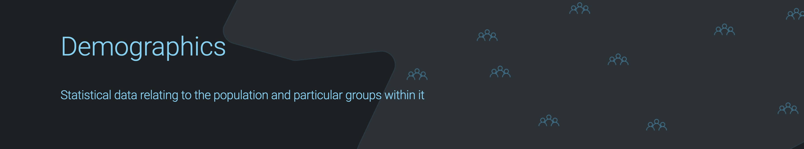
This theme features data visualizations of *Population of Dublin varying over time*, *Households in Dublin* in terms of total number (count) and household sizes, and *Population Born Outside the State* (rate) both in the Dublin City and in the State.
  - Note: *Households in Dublin* and *Population Born Outside the State* features are **not** working properly.

*1.2.2 [Stories](https://www.dublindashboard.ie/stories)*
Stories are created to provide the most amount of context to the raw data presented. Reading through stories can greatly help the audience to understand the historical, economical, social, and perhaps political context of the data.
- *HOUSING IN THE DUBLIN REGION, 1991 TO PRESENT*: This story is a detailed encounter of the historical, economical, social and political context overview of Dublin's housing data from that time period. Based on the detailed context, the authors were able to tell the story about what happened to Bulin housing, how it happened, and why it happened.
- *Story Coming Soon*: a placeholder for a future story.

*1.2.3 [Queries](https://www.dublindashboard.ie/queries)*
Queries are tools built to help the audience to interact with the maps and visualizations to answer their own questions.
- *Property Price Register*: This query combines individual records of property sales from the residential Property Price Register with historical trend data. This query allows the users to explore a specific region of the Dublin city and compare its property sale prices of recent dates and their historical trend.
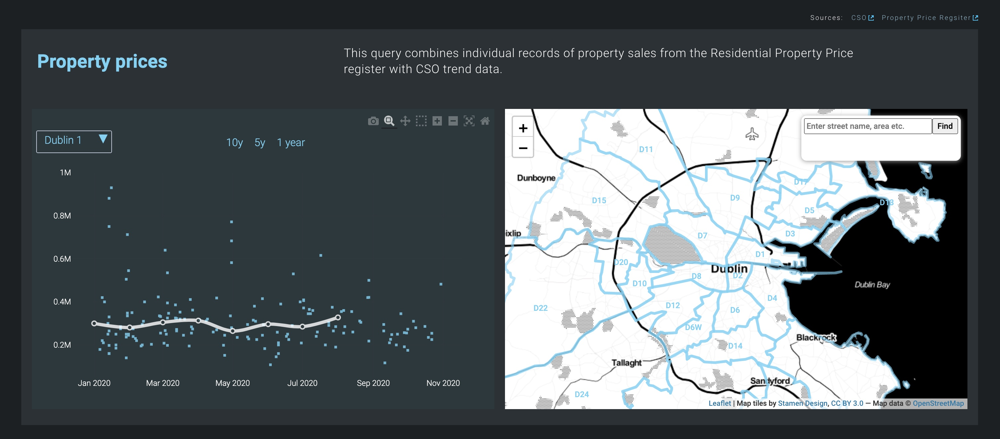
- *Geodemographics*: This query tool provides demographic information about regions of the Dublin City. These regions are divided into groups, seemingly based on their demographic characteristics. Users can click any tile to see the classification and name of the region.
- *Live Travel Map*: Still under construction
- *Economy at a Glance*: Still under construction

*1.2.4 [Tools](https://www.dublindashboard.ie/tools)*
Everything under this section was still under construction.

***1.3 Intended audience***
The [Dublin Dashboard](http://www.dublindashboard.ie) provides citizens, planners, policy makers and companies with an extensive set of data and interactive data visualizations about Dublin City, including real-time information, indicator trends, inter and intra-urban benchmarking, interactive maps, location-based services, a means to directly report issues to city authorities, and links to city apps. The data used in the Dashboard is open and available for others to build their own apps.

***1.4 Analysis of Webmap Element Used***
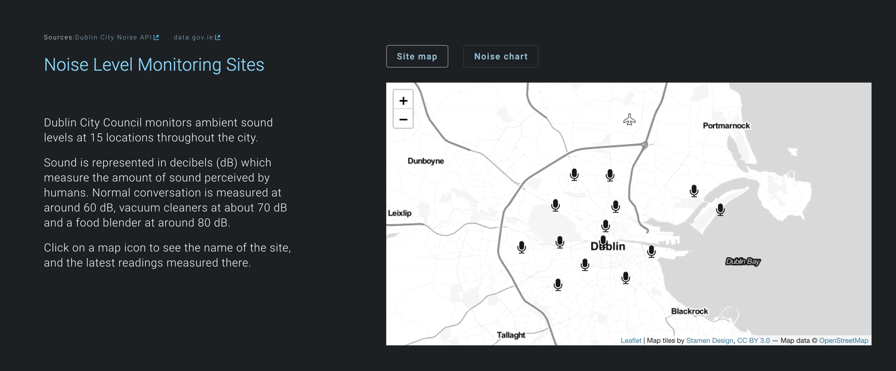
Shown above is a typical webmap presented by the Dashboard. It is clear that it does not feature too many elements. It only has zoom in/out buttons and icons representing noise monitoring sites. It does not have any scale bar, north arrow, or legends.
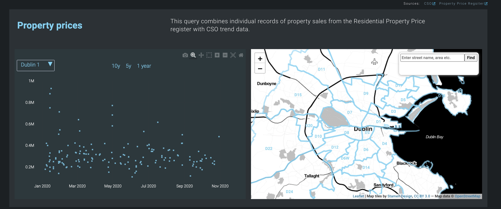
With the query tools, the user has access to a search bar, where they can input Dublin addresses and see the results reflected on the map.

***1.5 Authors and Affiliations***
According to *The praxis and politics of building urban dashboards*, the Dublin Dashboard was built by two of the authors of the article. I was not able to identify which two authors participated in building the dashboard. Hence, all three authors are listed here.
- **Rob Kitchin**: National Institute for Regional and Spatial Analysis, National University of Ireland Maynooth, Ireland
- **Sophia Maalsen**: School of Geosciences, University of Sydney, Australia
- **Gavin McArdle**: School of Computer Science, University College Dublin, Ireland

***1.6 Date of Data Collected***
The website utilizes the power of API, which pulls data regularly from third-party servers. Hence, the data on the website is **constantly** being updated to reflect the newest data available. Therefore, the exact date of data collected is irrelevant for this dashboard.

***1.7 A List of Data Sources***
A more detailed list can be found [here](https://www.dublindashboard.ie/portal). The following list is abbreviated and intended for reference purposes only.
- **Central Statistics Office**: This office is Ireland's official agency for collecting and reporting statistics about Ireland's people, society, and economy. This data source was used to create the [Demographics theme](https://www.dublindashboard.ie/themes#demographics).
  - Note: The link provided by the Dashboard authors is **broken** and **cannot redirect** to the correct data source webpage.
- **Department of Housing, Planning & Local Government**: This is the Official Irish government department responsible for housing, planning and local government. This data source is used to create the [Housing theme](https://www.dublindashboard.ie/themes#housing).
  - Note: The link provided fails to redirect to the correct webpage hosted on the department's website. The original hyperlink routing direction must have been updated over the years. An update to the link is required to restore correct redirection.
- **Dublin Bikes API**: This data source is created by Derilinx, a company dedicted to "high-quality Linked & Open Data solutions". The API itself provides **dynamic data** such as station state, number of available bikes, number of free bike stands, etc. and **static data** such as bike station position, number of bike stands, payment terminal availability, etc.
  - Note: The link provided by the Dashboard authors fails to provide enough context and information regarding the API. Information about the API was found by me [here](https://data.smartdublin.ie/dataset/dublinbikes-api) and information about Derilinx was found by me [here](https://derilinx.com/about/).
- **Dublin City Air and Noise**: After a brief research, it is most likely that this data source is related to the Dublin City Council and its credibility most likely inherits that of the city council. This datasource is likely used to create the Environment theme's [Noise Level Monitoring Sites map](https://www.dublindashboard.ie/themes#environment). But as of the date of me writing this markdown essay, this webmap is **not** working properly: the webmap cannot pull/display the data correctly.
- **Enviromental Protection Agency (EPA)**: "The Environmental Protection Agency is at the front line of environmental protection and policing.  We ensure that Ireland's environment is protected, and we monitor changes in environmental trends to detect early warning signs of neglect or deterioration." - [EPA](http://epa.ie/about/roles/). The exact use of this data source was not listed on the Dashboard website.
  - Note: The hyperlink is **not** redirecting properly.
- **Irish Rail Realtime API**: Irish Rail is Ireland's national railway operator, providing passenger and freight rail services. The Irish Rail Realtime API provides realtime station and train data including estimation of train times based on current train location.
- **LUAS Forecasting API**: The LUAS Forecasts system provides a real-time feed of expected LUAS arrivals for every stop on the Red and Green Lines. The LUAS uses an Automatic Vehicle Location System (AVLS) to locate trams. The Forecasting system uses these updates to predict arrival times at platforms on the lines.
- **Met Éireann Weather Forecast API**: Met Éireann is Ireland's National Meteorological Service and a line division of the Department of Housing, Planning and Local Government. Its mission is to monitor, analyse and predict Ireland’s weather and climate, and to provide a quality meteorological and related information to its customers.
- **Residential Property Price Register**: The Residential Property Price Register includes Date of Sale, Price and Address of all residential properties purchased in Ireland since the 1st January 2010.
- **Transport for Ireland**: This site was used to collect public transport data.
- **Transport Infrastructure Ireland (TII)**: TII provides access to various kinds of transport infrastructure related data sets, which are constantly updated.

### 2. Systematic Architecture
This Dashboard project relies on external sources for its data. It has two main ways of interacting with external sources: 1) through APIs, 2) data files.

APIs are common ways that third parties can use to request and reformat raw data from a third-party data provider. This Dashboard does not appear to be using any databases. This Dashboard uses many APIs such as the Irish Rail Realtime API, the LUAs Forecasting API, and the Met Éireann Weather Forecast API. It directly pulls data from these APIs on the server side and renders the data on the website's client-side data visualization or webmap. It does not appear to be storing data pulled from the API in any permanent form on the website.

Other than pulling constantly updated data from APIs, the Dashboard also uses data downloaded from third-party sources. It stores these data files on the website, not a database, and uses that data to build its applications.

In [Phase 1: 1991-2003 (The Celtic Tiger years) of the Stories section](https://www.dublindashboard.ie/stories/housing-crisis-phase-1), all the data visualizations and webmaps are created using data from csv files. We can see evidence of this by examining the source of the website:
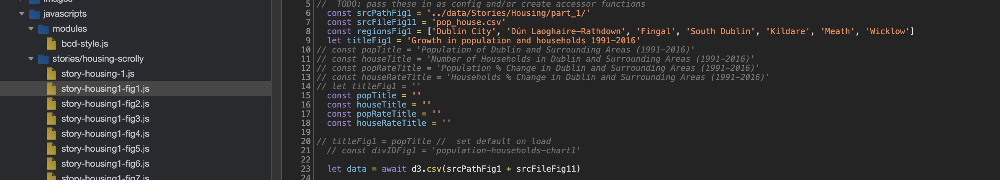
From the above code, the following three lines are evident of the data source:
``` Javascript
const srcPathFig1 = '../data/Stories/Housing/part_1/'
const srcFileFig11 = 'pop_house.csv'
let data = await d3.csv(srcPathFig1 + srcFileFig11)
```
It is easy to see that **pop_house.csv** was the csv file that holds the data to be plotted onto the website. Similar use of csv files can be found throughout this webpage and the website.

Below is an example of the usage of APIs as data sources:
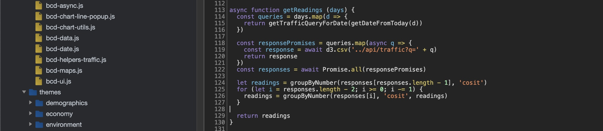
The above code is only part of the code base that enables the function. We do not have enough space nor the need to show the entire code base. But we can see from the following lines of code that this block of code is trying to pull data from an API, not a database and certainly not a file:
```Javascript
const responsePromises = queries.map(async q => {
  const response = await d3.csv('../api/traffic?q=' + q)
  return response
})
const responses = await Promise.all(responsePromises)
```

### 3. UI/UX Design Critique
- Does this project support responsive design?
- Describe the basemap, the thematic layer and the interactive features

The UI/UX Design and webmap implementation of this dashboard is relatively poor. Although it does feature some level of responsive design such as zoom in/out, filtering, and pop ups, I am still constantly frustrated by the user experience it provides. Overall, I found the UI/UX design of data visualizations to be okay and useful, but the UI/UX design of webmaps are very complicated, confusing, and difficult to use.

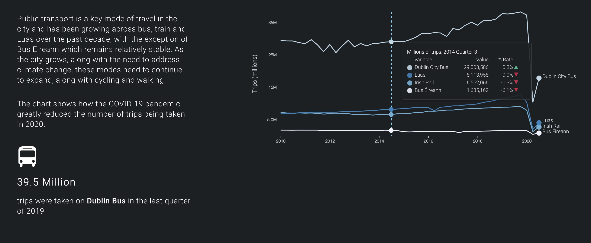
Shown above is the data visualization for public transport data of the Dublin city. It is clear what the graphics was intended to show. We can easily digest information from the graphics by looking at the legends, the pop ups, and explanatory paragraphs on the left-hand side. We can easily see that there is significant decrease in public transport usage amid the COVID-19 outbreak.

One critique that I will give is that the lines representing different transport services all use some shades of blue, causing difficulty in differentiating the services. It would be better if the color choices are more bold, more distinctive, and more contrasty.

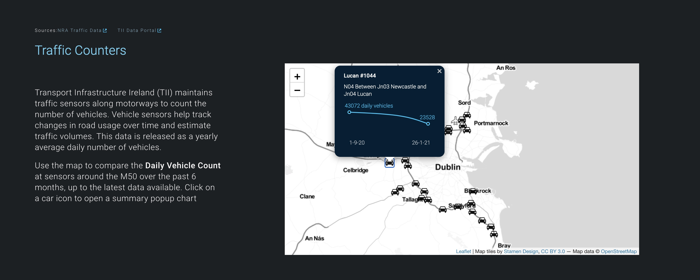
Shown above is one of the webmaps implemented by the Dashboard. There are several problems with this map. First of all, it is not clear what Traffic Counters means. After reading the explanatory paragraphs, I think the term refers to **the Estimated Daily Vehicle Count of a Given Road/Region Based on Sensor Readings**. In any case, Traffic Counters does not provide a good information in helping understand what data is shown in the map.

Secondly, the icons in the webmap are very similar to the basemap. We typically would want a clear distinguishment between the thematic layer and the basemap layer. Using a similar color palette and artistic style certainly does not help towards that goal.

Thirdly, the fact that every car icon can be clicked to reveal a pop-up window is not clearly indicated. It is mentioned in the paragraphs but it is hard to know for audience who skip reading the long and boring paragraphs. It would be better if the authors include a sentence highlighting that more information can be revealed by clicking the car icons. The pop ups are especially important to this webmap because they provide all the useful data and information that are not present elsewhere.

Fourthly, like I mentioned above, this webmap relies heavily on the use of pop up to reveal information since it does **not** provide any inforamtion by itself! I think a variation in the icon's sizes or colors to indicate a variation in value would easily solve this problem.

Fifthly, it lacks webmap elements such as a North Star, Scale Bar, or Legends. This makes the webmap utterly unuseable for any application other than web browsing.

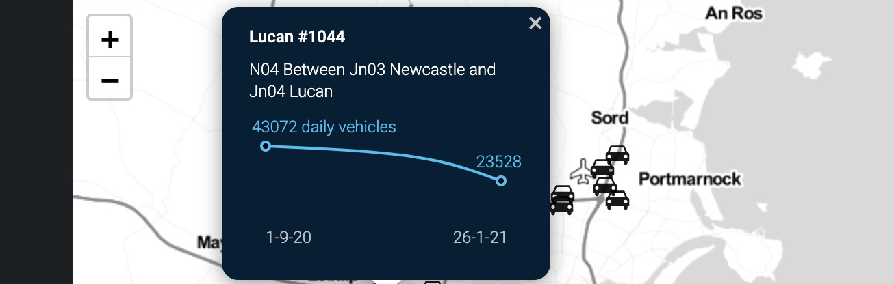
Sixthly, the pop up window features text that are not easily understandable. **"N04 Between Jn03 Newcastle and Jn04 Lucan" sounds to me more like Morse code rather than a proper human language.** The authors seem to expect their audience to know quite a lot about the data they are showing but that expectation is unrealistic and irrespective. Beyond that, the tiny graphs shown in the pop ups are not very useful at all.


### 4. Pros and Cons
There are several highlights of this Dashboard project. The first one is that it provides a great example of how a city dashboard should look like. I think the authors deserve a lot of credits when it comes to defining a dashboard layout, determining its functionalities, and building out a viable product. Although it is quite clear that this project is still technically **in progress**, wtih a lot of features either not implemented or poorly implemented, I can see their vision for a dashboard that can provide data access, visualizations, webmap services, and query services. At this moment, the current iteration lacks behind this vision of a comprehensive website hub and time and efforts are still needed to complete the project in the future.

Another pro of this project is the implementation of the **stories** section, which I found to be very interesting, engaging, and informative. A storytelling format can easily bring the audience into the world where the data were collected, providing them the crucial information of the society, economy, people, and the world at the time. We **need** context to truly understand basically anything, from column names of csv files to piles and piles of raw data acquired from APIs. Stories are the best way to help us understand them. Perhaps not the most digital-friendly way of presenting data and observations, but certainly irreplaceable for any dedicated researchers interested.

There are many cons of this project as well. I will be naming a few significant ones below. The most glaring con is perhaps the feeling of incompleteness of the Dashboard project. Granted this project is hard to implement and even harder to maintain, there is no getting around the fact that many features are not working, reporting errors, and/or having broken links. This eliminates the Dashboard project for any serious researchers, because it is simply not reliable. We need to see that the project performs as intended before we can trust it as our data source and build our applications on top of it.

### 5. Reflection
To me, the Dublin Dashboard is a symbol of digitizations of the world brought by the contemporary technological advancements. There is argument to be made about how digitized versions of things hold numerous advantages over a physical copy, such as durability, duplicability, and shareability, etc. While these characteristics are cool and useful, they do not take away the fact that digitizations may not be accessible to every potential audience.

In the course, we discussed an important social theory in the form of digital divide. The concern raised by this idea can be found in the applications of digital dashboards too. There is no doubt that the Dublin Dashboard is a fantastic tool and hub for many researchers of Dublin granting them the ability to acquire data from various sources simultaneously. But what about those who do not have access to the internet? What about people with disabilities such as blindness? What about the under-educated?

It can be argued that many technologies have accessibility functions that developers could turn to when building the application so that more people can have access to the content. For example, the developers of the Dublin Dashboard can design and build the website with **screenreaders** in mind so that people with visual impairment can benefit from the website too. But unfortunately, after examining the source code, little evidence shows that this task is very high on their list. In many cases, building for accessibility is more like an afterthought of the team for the sake of good PR rather than a major requirement of projects. Besides, there are challenges to building for accessibility as well, people's capability of interacting with technologies vary quite a lot. Designing and building for such a wide variation of capability can be a daunting and exhausting task and many companies, organizations, teams choose not to do so.

Therefore, rather than blaming the team of Dublin Dashboard for the oversight of not paying enough attention to deal with digital divide. I argue that digital divide as a social concern is bigger in scope than that of this one project. We need to take a holistic view of our society when thinking about digital divide. Even though I do not think completely eradicating digital divide is in any way, shape, or form possible due to the magnitude of considerations and micro adjustments needed, I think we should invest decent efforts in all digital products to adapt them to as many people as possible.

For the Dublin Dashboard, I understand that there are a lot of things possibly taking priority over accessibility for the developers such as fixing visualizations, and implementing major functions, etc., I want to remind them that the accessibility of a product/project should not be overseen. The efforts that developers undertake would benefit the vulnerable minorities of our society immensely. Together we can make designing and building for accessibility the new social norm of practice.

### 6. Reference
Kitchin, R., Maalsen, S., &amp; McArdle, G. (n.d.). *The dublin dashboard.* Retrieved March 02, 2021, from [https://www.dublindashboard.ie/](https://www.dublindashboard.ie/)
